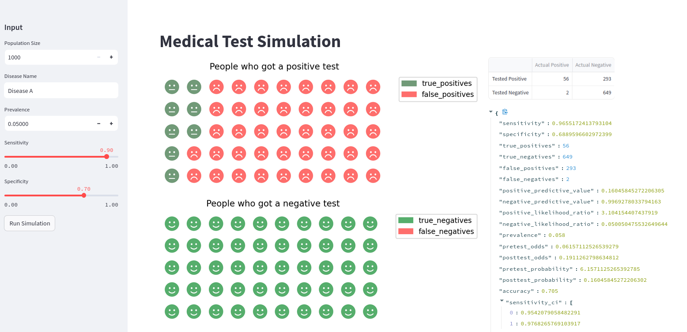

<meta http-equiv="X-Clacks-Overhead" content="GNU Terry Pratchett" /> 

# H.E.X (Health (test) Evaluation Xenoscope)[^1]

Hex is a tool to visualize and explore medical diagnostic test results.

It uses streamlit to create an interactive data app that allows users to understand the relationships between different tests and their statistics. 

It is live here: [hex](https://healthhex.streamlit.app/)

This is what it looks like.

My overall aim is to build things that are useful for practitioners and teachers and students to get a better visual understnding of the diagnosis making ~~obscrurantism~~ process

This app probably doesn't do that too well,but it is interesting to ask yourself, do I trust this test report?

The answer will not surprise you once you've tried out [hex](https://healthhex.streamlit.app/)

## Footnotes:
[^1]: [Hex](https://wiki.lspace.org/Hex)
